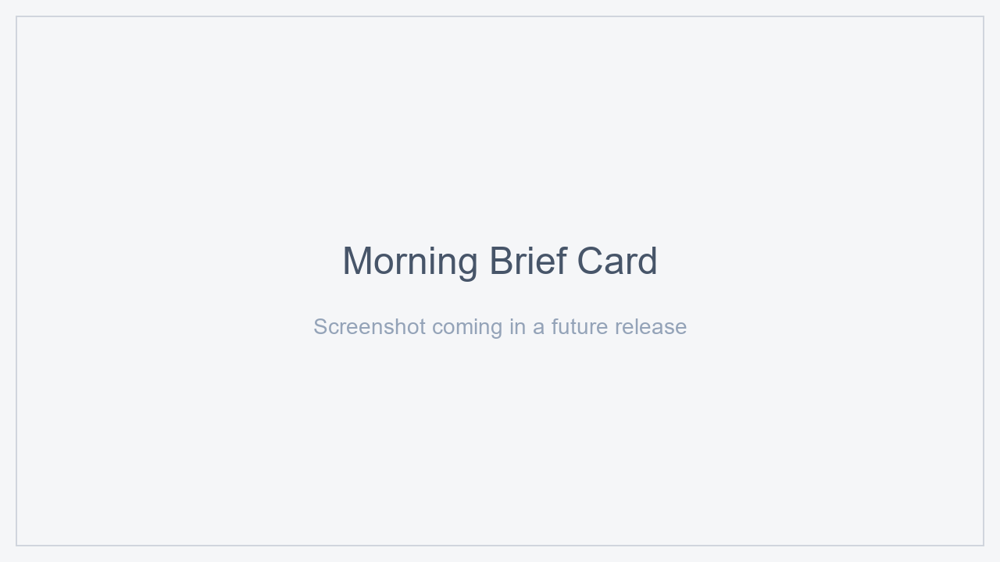

# Morning Brief Card

> Lovelace custom card that renders the canonical JSON produced by the
> [`ha-morning-brief`](https://github.com/machintrucbidule/ha-morning-brief) integration.

[](https://hacs.xyz/)
[](https://github.com/machintrucbidule/ha-morning-brief-card/actions/workflows/lint-build.yml)
[](LICENSE)



## 1. What is it?

A LitElement-based Lovelace card that takes a `sensor.morning_brief_*` entity and renders a clean, themed brief: header with history navigation, alerts banner, per-category field lists with comparisons + sparklines, weather block, AI verdict, footer.

## 2. Requirements

- Home Assistant Core ≥ 2024.11
- The companion [`ha-morning-brief`](https://github.com/machintrucbidule/ha-morning-brief) integration installed and producing a `sensor.morning_brief_*` entity
- HACS (recommended)

## 3. Installation

### Via HACS

1. HACS → Frontend → ⋮ → Custom repositories
2. Add `https://github.com/machintrucbidule/ha-morning-brief-card`, category **Lovelace**
3. Install **Morning Brief Card**
4. Add it to your dashboard via the Lovelace UI

### Manual

Copy `dist/morning-brief-card.js` into your HA `config/www/`, then register a resource in your dashboard pointing to `/local/morning-brief-card.js` of type **Module**.

## 4. Usage

Minimal:

```yaml
type: custom:morning-brief-card
entity: sensor.morning_brief_default
```

Compact (hides sparklines, comparisons, AI insights, footer):

```yaml
type: custom:morning-brief-card
entity: sensor.morning_brief_default
compact_mode: true
```

See [`docs/examples/basic.yaml`](docs/examples/basic.yaml) and [`docs/examples/compact.yaml`](docs/examples/compact.yaml).

## 5. Configuration

| Key | Type | Default | Description |
|---|---|---|---|
| `entity` | string | (required) | A `sensor.morning_brief_*` produced by the integration |
| `compact_mode` | bool | `false` | Hide comparisons, AI insights, sparklines, footer |
| `show_history_nav` | bool | `true` | Show ← → buttons for browsing past briefs |
| `show_ai_sections` | bool | `true` | Show AI insights + verdict |
| `show_alerts` | bool | `true` | Show alerts banner |
| `show_weather` | bool | `true` | Show weather synthesis |
| `show_footer` | bool | `true` | Show footer (AI status + logical date) |
| `theme_override` | string | (optional) | Override the accent CSS colour |

All options are also editable from the visual editor.

## 6. Theming

The card uses Home Assistant CSS variables (`--primary-color`, `--secondary-text-color`, `--card-background-color`, etc.) so it inherits whatever theme is active. `theme_override` lets you set an accent independently of the active HA theme.

## 7. History navigation

The card reads `previous_briefs_refs` from the canonical JSON. The **←** / **→** buttons navigate the FIFO via the `morning_brief.get_brief_by_uuid` service. The **⟳** button triggers `morning_brief.generate` with `force: true`.

## 8. Multilanguage

Strings live in `src/i18n/<lang>.json`. The loader picks `hass.language` (fallback `en`). Adding a new language: drop a new JSON file in `src/i18n/` matching the EN key set, then register it in `src/i18n/index.ts`.

## 9. Development

```sh
git clone https://github.com/machintrucbidule/ha-morning-brief-card
cd ha-morning-brief-card
npm install
npm run typecheck
npm run lint
npm run build  # produces dist/morning-brief-card.js
```

The built bundle is committed to `dist/` per HACS plugin convention.

## 10. License

MIT — see [LICENSE](LICENSE).
